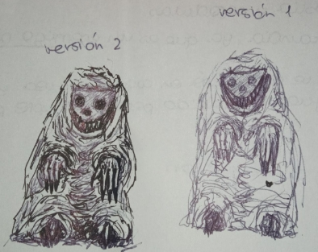
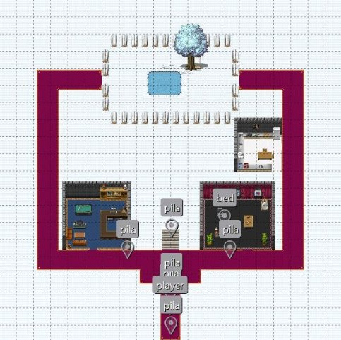

**DOCUMENTO:** *Game Design Document*

**AUTHOR/S**: Julia Fluiters Pereira, Laura Martínez Tomás, Víctor Giménez Chillada y Francisco Javier Antoranz Esteban

**ÍNDICE**

[**1. INTRODUCCIÓN**](#_heading=h.30j0zll)

[1.1 GAME CONCEPT](#_heading=h.1fob9te)

[1.1.1 INFORMACIÓN BÁSICA](#_heading=h.3znysh7)

[1.1.2 DESCRIPCIÓN](#_heading=h.2et92p0)

[1.1.3 CARACTERÍSTICAS PRINCIPALES](#_heading=h.tyjcwt)

[1.1.4 RIESGOS](#_heading=h.3dy6vkm)

[1.2 ESTÉTICA](#_heading=h.1t3h5sf)

[1.2.1 ARTE](#_heading=h.4d34og8)

[1.2.2 MÚSICA Y SONIDO](#_heading=h.2s8eyo1)

[**2. MECÁNICAS**](#_heading=h.17dp8vu)

[2.1 FLUJO DEL JUEGO](#_heading=h.3rdcrjn)

[2.2 MUNDO](#_heading=h.26in1rg)

[2.3 JUGADOR](#_heading=h.lnxbz9)

[2.4 ENEMIGOS](#_heading=h.35nkun2)

[2.5 COMBATE](#_heading=h.1ksv4uv)

[2.6 OBJETOS / ELEMENTOS](#_heading=h.44sinio)

[**3. CONTENIDO DE MUESTRA**](#_heading=h.1y810tw)

[**4. INTERFAZ**](#_heading=h.4i7ojhp)

[4.1 GUI](#_heading=h.2xcytpi)

[4.2 CONTROLES](#_heading=h.1ci93xb)

[**5. REFERENCIAS**](#_heading=h.3whwml4)

# 1. **INTRODUCCIÓN**
## 1.1 GAME CONCEPT
### 1.1.1 INFORMACIÓN BÁSICA
**Título**			: ¡Que viene el COCO!

**Género**		: Terror y puzzle 

**Plataforma**		: Web

**Público objetivo**	: mayores de 12 
### 1.1.2 DESCRIPCIÓN
En este juego se toma el rol de un niño pequeño que tiene que meterse en la cama antes de que llegue el COCO y se lo coma. Tendrá que recorrer su casa a oscuras con la ayuda de una linterna que necesitará mantener encendida para no pasar miedo y perder cordura, pero cuidado, las pilas de la linterna se pueden agotar, y tendrá que buscar más para mantener la luz. 

A través de los pasillos de su casa y escondiéndose de figuras extrañas, tendrá que resolver puzzles y encontrar caminos para llegar a su cama sano y salvo. Según progresan las noches la casa sufrirá cambios extraños y los peligros a los que se tendrá que enfrentar el pequeño Filemón aumentarán.
### 1.1.3 CARACTERÍSTICAS PRINCIPALES
**Vista:** TOP-DOWN

**Desplazamiento:** Multidireccional

**Gráficos:** Pixelados

**Sonido:** Por determinar

**Dificultad:**  Por determinar

**Cordura:** Estado del personaje que depende de la luz

**Linterna:** Objeto que funciona con **pilas**

**Cabeza de pesanta:** Enemigo menor

**Casa, Puzzles, Acertijos e Inventario.**
### 1.1.4 RIESGOS
Movimiento predeterminado de Cabeza de Pesanta está habiendo dificultades para implementarlo. 

Puzzles y Acertijos puede que no dé tiempo a implementarlos.

Y, la implementación del inventario también está teniendo dificultades.
## 1.2 ESTÉTICA
### 1.2.1 ARTE 
Como ya se ha comentado anteriormente el juego a desarrollar es del género de terror, por lo que el arte del juego se intentará realizar con estética oscura, inspirándose en el juego de *Little Nightmares* como meta para ocasionar la sensaciones debidas acorde con el género. El juego se va a diseñar con un arte 2D.

Lo que se quiere transmitir con el diseño del juego es una sensación de incomodidad  y tensión.

Para los personajes, hemos diseñado a los enemigos de forma grotesca de ese modo, no sólo inspirado en sus correspondientes mitos (el mito de El Coco y de Pesanta), sino también algo exagerado para poder generar esas sensaciones.

El personaje del niño, Filemón, tiene un diseño simple, ya que es pequeño e inocente.

Algunos bocetos y diseños:

**El Coco**

**Cabeza de Pesanta**

**Filemón**

### 1.2.2 MÚSICA Y SONIDO
*Por determinar*

# 
# 2. **MECÁNICAS**
## 2.1 FLUJO DEL JUEGO
El jugador comienza en una zona de la casa sin pilas, es decir, no tiene luz hasta que encuentre alguna pila y se tiene que desplazar hasta encontrar la cama para irse a dormir, y así es como termina una noche.

Entre medias habrá que resolver acertijos y puzzles para encontrar el camino que le lleva a su cama, evitando los momentos de demasiada oscuridad y los monstruos ya que harán que su cordura baje hasta perderla por completo y como consecuencia, la partida también.
## 2.2 MUNDO
La historia se desarrolla en la casa de Filemón por la noche, algo grande y con distintas habitaciones que guardarán los distintos objetos que habrá que recoger durante el juego.

El tipo de cámara que se ha usado es la vista TOP-DOWN, inspirada en la cámara de juegos como *Undertale*, uno de los juegos referenciados. Hemos optado por esta ya que juegos con espacios cerrados es bastante útil y consiste en un modelo visto de manera que parece que el eje vertical ha sido inclinado y se ve algo más del suelo.
## 2.3 JUGADOR
El jugador maneja a Filemón, el protagonista del juego, un niño pequeño y asustadizo que busca el camino de vuelta a su cama en mitad de la noche.

Sus distintas interacciones son:

- Encender y apagar la linterna.
- Recoger y desechar objetos. El jugador tendrá la opción de recoger y desechar los objetos que se encuentre durante el juego.
- Interactuar con el entorno (esconder, leer, abrir…). Durante el juego, el personaje tendrá la oportunidad de encontrar armarios, que le servirán para esconderse. Además, mientras el jugador se encuentre dentro del armario permanecerá seguro, ya que los enemigos no podrán alcanzarle y podrá regenerar una cantidad fija de cordura (no muy alta para no desbalancear el juego), sin gastar pilas de la linterna. También se podrá encontrar habitaciones o lugares concretos que sean seguros y que cumplirán la misma función que los armarios. Por otro lado, si el jugador se encuentra con algún enemigo fuera de las zonas seguras, su cordura bajará rápidamente.

## 2.4 ENEMIGOS
**Coco**

|

*Provisional*
|Enemigo principal, un simple encuentro disminuirá considerablemente tu cordura. De momento, no se tiene pensado que haga una aparición como tal, sólo se mencionará.|
| - | - |

**Cabezas De Pesanta**

||Enemigos más débiles que el COCO, pero harán de tu camino una pesadilla. Rápidos e insistentes. Son más rápidos que Filemón con linterna, pero más lentos que sin linterna. Siguen una ruta predeterminada y aparecen en distintos puntos de la casa y acercarse a este implicaría que la cordura de Filemón bajaría más rápido que cuando no se encuentra con luz. Hay que evitarlos. No es posible derrotarlos sólo se puede huir de ellos.|
| :- | - |
## 2.5 COMBATE
No existe ningún tipo de combate, hay que evitar a los enemigos.
## 2.6 OBJETOS / ELEMENTOS
**Pila**

||Objeto que permite prolongar la duración de la luz de la linterna. Se encuentran pilas repartidas a lo largo de toda la casa.|
| - | - |

**Linterna**

||En el juego se podrá contar con una linterna que se irá apagando a medida que la usas. Será necesario el uso de pilas para encender la linterna, además, estas sólo mantendrán la linterna encendida durante un periodo de tiempo limitado. La luz de la linterna aumentará la cordura del personaje gradualmente, en cambio, mientras el personaje está a oscuras el indicador de cordura bajará, pero también se beneficiará de un aumento de la velocidad de movimiento.|
| :- | - |

**Inventario**

|*Pendiente*|El protagonista contará con bolsillos para llevar objetos, pero habrá un límite de pilas que pueda cargar a la vez, u objetos.|
| :-: | - |

**Notas, pistas, objetos claves**

|*Pendiente*|Correspondientes con los puzzles y acertijos, algunos ocupan espacio en el inventario, otros no, como las notas.|
| :-: | - |

**Cama**

||El objeto más importante del juego ya que con ello concluye la noche y termina el juego o pasa a la siguiente noche.|
| :- | - |

**Cordura**

|

*En la parte derecha arriba del juego*
|Es el elemento más importante ya que baja más cuanto más tiempo estés en la oscuridad o estés cerca de los enemigos.|
| :- | :- |

# 3. **CONTENIDO DE MUESTRA**
Hasta el momento, sólo tenemos desarrollado lo básico del primer nivel, sin enemigos ni puzzles

El juego comienza en el primer nivel con Filemón en un pasillo a oscuras con su linterna a mano aunque sin batería, por lo que su primer objetivo es conseguir alguna pila para evitar perder demasiado la cordura.

Habrá que avanzar hasta encontrar la cama para, como bien da a intuir el nombre del juego, evitar que el Coco venga a por Filemón. Una vez se encuentre, al igual que con el resto de objetos, se interactúa con la tecla E para terminar la noche con éxito.

Este es el final bueno de la noche porque hay otro final, el malo. Por eso hay que tener cuidado con la cordura si desciende demasiado hasta perderla.

Mapa de la casa con la distribución de las pilas, el jugador y la cama para el primer nivel.

# 4. **INTERFAZ**
## 4.1 GUI
## 
## 4.2 CONTROLES
El juego está diseñado para ordenador y para ser jugado con el teclado y ratón. Los controles los podemos dividir en dos tipos, aunque ambos giran en torno al personaje principal del juego. Tenemos los controles enfocados al movimiento: 

- Tecla W: movimiento hacia arriba 
- Tecla S: movimiento hacia arriba 
- Tecla A: movimiento hacia arriba 
- Tecla D:  movimiento hacia arriba 

Controles enfocados a la interacción: 

- Tecla E: interacción con el entorno (recoger objetos, dormir, etc)
- Tecla F: encender y apagar la linterna

Adicionalmente para pulsar botones en la pantalla de inicio u otros menús, se utiliza el click izquierdo del ratón.

# 5. **REFERENCIAS**
Algunas referencias de videojuegos que nos han ayudado a diseñar diferentes aspectos del juego son: 

**Undertale** con respecto a la perspectiva desde la que se ve el juego y su arte.

**Little Nightmares (tanto I como II)** por sus vibes y sensaciones de tensión e incomodidad, así cómo se han diseñado los monstruos de manera grotesca.

**Visage**, **Amnesia** y **Phasmophobia** debido a la mecánica de la cordura, una de las mecánicas principales del juego. En estos juegos, sobre todo de Amnesia (The Dark Descent), la cordura depende de la luz y conforme más pasa en la oscuridad más la pierde. Se puede recuperar por pociones, en nuestro caso no lo hemos implementado así. Visage también se ve afectada por la oscuridad aunque también por efectos paranormales. Algo parecido ocurre con Phasmophobia.

En este enlace se habla más detalladamente de la cordura presente en el juego de Amnesia:

<https://amnesia.fandom.com/es/wiki/Cordura>

Visage

Y en cuanto a Phasmophobia, este artículo habla también de la cordura: 

<https://vandal.elespanol.com/guias/guia-phasmophobia-trucos-consejos-y-secretos/niveles-de-cordura>

