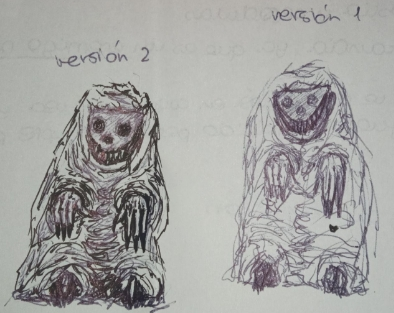
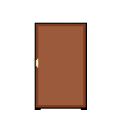
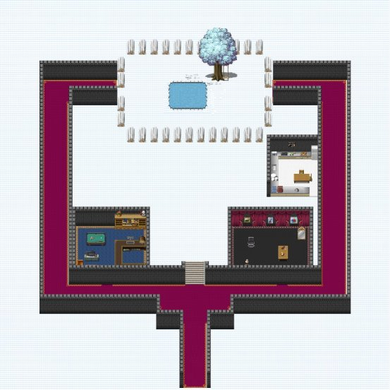



**DOCUMENTO:** *Game Design Document*

**AUTHOR/S**: Julia Fluiters Pereira, Laura Martínez Tomás, Víctor Giménez Chillada y Francisco Javier Antoranz Esteban

**ÍNDICE**

[**1. INTRODUCCIÓN**](#_heading=h.30j0zll)

[1.1 GAME CONCEPT](#_heading=h.1fob9te)

[1.1.1 INFORMACIÓN BÁSICA](#_heading=h.3znysh7)

[1.1.2 DESCRIPCIÓN](#_heading=h.2et92p0)

[1.1.3 CARACTERÍSTICAS PRINCIPALES](#_heading=h.tyjcwt)

[1.1.4 RIESGOS](#_heading=h.3dy6vkm)

[1.2 ESTÉTICA](#_heading=h.1t3h5sf)

[1.2.1 ARTE](#_heading=h.4d34og8)

[1.2.2 MÚSICA Y SONIDO](#_heading=h.2s8eyo1)

[**2. MECÁNICAS**](#_heading=h.17dp8vu)

[2.1 FLUJO DEL JUEGO](#_heading=h.3rdcrjn)

[2.2 MUNDO](#_heading=h.26in1rg)

[2.3 JUGADOR](#_heading=h.lnxbz9)

[2.4 ENEMIGOS](#_heading=h.35nkun2)

[2.5 COMBATE](#_heading=h.1ksv4uv)

[2.6 OBJETOS / ELEMENTOS](#_heading=h.44sinio)

[2.7 ACERTIJOS](#_heading=h.st4d8mtrrmd0)

[**3. CONTENIDO DE MUESTRA**](#_heading=h.1y810tw)

[3.1 NIVELES](#_heading=h.4ri9jvhbibys)

[**4. INTERFAZ**](#_heading=h.4i7ojhp)

[4.1 GUI](#_heading=h.2xcytpi)

[4.2 CONTROLES](#_heading=h.1ci93xb)

[**5. REFERENCIAS**](#_heading=h.3whwml4)

# 1. **INTRODUCCIÓN**
## 1.1 GAME CONCEPT
### 1.1.1 INFORMACIÓN BÁSICA
**Título**			: ¡Que viene el COCO!

**Género**		: Terror y puzzle 

**Plataforma**		: Web

**Público objetivo**	: mayores de 12 
### 1.1.2 DESCRIPCIÓN
En este juego se toma el rol de un niño pequeño que tiene que meterse en la cama antes de que llegue el COCO y se lo coma. Tendrá que recorrer su casa a oscuras con la ayuda de una linterna que necesitará mantener encendida para no pasar miedo y perder cordura, pero cuidado, las pilas de la linterna se pueden agotar, y tendrá que buscar más para mantener la luz. 

A través de los pasillos de su casa y escondiéndose de figuras extrañas, tendrá que resolver puzzles y encontrar caminos para llegar a su cama sano y salvo. Según progresan las noches la casa sufrirá cambios extraños y los peligros a los que se tendrá que enfrentar el pequeño Filemón aumentarán.
### 1.1.3 CARACTERÍSTICAS PRINCIPALES
**Vista:** TOP-DOWN

**Desplazamiento:** Multidireccional

**Gráficos:** Pixelados

**Sonido:** Por determinar

**Dificultad:**  Por determinar

**Cordura:** Estado del personaje que depende de la luz

**Linterna:** Objeto que funciona con **pilas**

**Cabeza de pesanta:** Enemigo menor

**Casa, Puzzles, Acertijos e Inventario.**
### 1.1.4 RIESGOS
Puzzles y Acertijos no ha dado tiempo a implementar los acertijos como notas propuestas.
## 1.2 ESTÉTICA
### 1.2.1 ARTE 
Como ya se ha comentado anteriormente el juego a desarrollar es del género de terror, por lo que el arte del juego se intentará realizar con estética oscura, inspirándose en el juego de *Little Nightmares* como meta para ocasionar la sensaciones debidas acorde con el género. El juego se va a diseñar con un arte 2D.

Lo que se quiere transmitir con el diseño del juego es una sensación de incomodidad  y tensión.

Para los personajes, hemos diseñado a los enemigos de forma grotesca de ese modo, no sólo inspirado en sus correspondientes mitos (el mito de El Coco y de Pesanta), sino también algo exagerado para poder generar esas sensaciones.

El personaje del niño, Filemón, tiene un diseño simple, ya que es pequeño e inocente.

Algunos bocetos y diseños:

**El Coco**

**Cabeza de Pesanta**

**Filemón**

### 1.2.2 MÚSICA Y SONIDO
La música, alguna ha sido creada por miembros del equipo. Aunque la mayoría de los sonidos han sido seleccionados de manera meticulosa de sonidos de libre distribución, así como alguna música, de manera que generen el ambiente deseado, es decir, tensión.

Cada comienzo de cada noche se informa de qué noche es con el sonido propio de las noches, de sonidos de insectos y viento.

También hay sonidos para la interacción de objetos como coger pilas, llaves y encender o apagar la linterna. Y sonidos para los monstruos en un intervalo de tiempo de cada 30 segundos.

Para cuando el jugador pierde la partida sale un sonido de chillido, dando a entender que el protagonista ha perdido la cordura y el menú que sale refiriéndose a que se ha perdido la partida es el sonido de un televisor sin señal, para generar tensión.

Y para cuando el jugador pasa la noche suena un sonido de victoria.

Siempre está presente el sonido de la lluvia pero se puede mutear.

# 
# 2. **MECÁNICAS**
## 2.1 FLUJO DEL JUEGO
El jugador comienza en una zona de la casa sin pilas, es decir, no tiene luz hasta que encuentre alguna pila y se tiene que desplazar hasta encontrar la cama para irse a dormir, y así es como termina una noche.

Entre medias habrá que resolver acertijos y puzzles para encontrar el camino que le lleva a su cama, evitando los momentos de demasiada oscuridad y los monstruos ya que harán que su cordura baje hasta perderla por completo y como consecuencia, la partida también.
## 2.2 MUNDO
La historia se desarrolla en la casa de Filemón por la noche, algo grande y con distintas habitaciones que guardarán los distintos objetos que habrá que recoger durante el juego.

El tipo de cámara que se ha usado es la vista TOP-DOWN, inspirada en la cámara de juegos como *Undertale*, uno de los juegos referenciados. Hemos optado por esta ya que juegos con espacios cerrados es bastante útil y consiste en un modelo visto de manera que parece que el eje vertical ha sido inclinado y se ve algo más del suelo.
## 2.3 JUGADOR

||El jugador maneja a Filemón, el protagonista del juego, un niño pequeño y asustadizo que busca el camino de vuelta a su cama en mitad de la noche.|
| :-: | - |

Sus distintas interacciones son:

- Encender y apagar la linterna.
- Recoger y desechar objetos. El jugador tendrá la opción de recoger y desechar los objetos que se encuentre durante el juego.
- Interactuar con el entorno (esconder, leer, abrir…). Durante el juego, el personaje tendrá la oportunidad de encontrar armarios, que le servirán para esconderse. Además, mientras el jugador se encuentre dentro del armario permanecerá seguro, ya que los enemigos no podrán alcanzarle y podrá regenerar una cantidad fija de cordura (no muy alta para no desbalancear el juego), sin gastar pilas de la linterna. También se podrá encontrar habitaciones o lugares concretos que sean seguros y que cumplirán la misma función que los armarios. Por otro lado, si el jugador se encuentra con algún enemigo fuera de las zonas seguras, su cordura bajará rápidamente.
- Velocidad cambiante según la luz. El jugador se moverá más rápido a oscuras (115), y más despacio con la luz encendida (70).  

## 2.4 ENEMIGOS
**Coco**

||Enemigo principal, es el tema principal del juego. Sin embargo, sólo se nombra.|
| :-: | - |

**Cabezas De Pesanta**

||Enemigos más débiles que el COCO, pero harán de tu camino una pesadilla. Rápidos e insistentes. Son más rápidos que Filemón con linterna, pero más lentos que sin linterna (10\*longitud del camino). Siguen una ruta predeterminada y aparecen en distintos puntos de la casa y acercarse a este implicaría que la cordura de Filemón bajaría más rápido que cuando no se encuentra con luz (8 unidades de cordura y 4 si se tiene la linterna encendida). Hay que evitarlos. No es posible derrotarlos sólo se puede huir de ellos porque la cordura baja muy rápido.|
| :-: | - |
## 2.5 COMBATE
No existe ningún tipo de combate, hay que evitar a los enemigos.
## 2.6 OBJETOS / ELEMENTOS
**Pila**

||Objeto que permite prolongar la duración de la luz de la linterna. Se encuentran pilas repartidas a lo largo de toda la casa. La pila tiene una carga por defecto de 500 unidades que desciende de uno en uno en cada actualización del juego (frame). |
| :-: | - |

**Linterna**

||
En el juego se podrá contar con una linterna que se irá apagando a medida que la usas. Será necesario el uso de pilas para encender la linterna, además, estas sólo mantendrán la linterna encendida durante un periodo de tiempo limitado. La luz de la linterna aumentará la cordura del personaje gradualmente, en cambio, mientras el personaje está a oscuras el indicador de cordura bajará, pero también se beneficiará de un aumento de la velocidad de movimiento.

Para dar más ambiente y generar frustración al jugador, encender la linterna es irregular, no funciona demasiado bien porque es vieja y cuesta, por lo tanto, encenderla.
|
| :-: | - |

**Armario**

||
Permite al jugador esconderse y recuperar coordura a la misma velocidad que la linterna y mientras se esté en su interior los monstros no afectarán a la cordura ni se gastarán las pilas.
|
| :-: | - |

**Inventario**

||
El protagonista contará con bolsillos para llevar objetos, pero habrá un límite de pilas que pueda cargar a la vez, u objetos.

El límite de las pilas que puede llevar el jugador es 3.

El límite de llaves máximas a llevar es 4, aunque no va a suceder porque cuando se usa una llave se desecha automáticamente.
|
| :-: | - |

**Notas, pistas, objetos claves**

||Correspondientes con los puzzles y acertijos, que son las llaves para las distintas puertas. La llave roja es para la puerta roja, así con todas.|
| :-: | - |

**Cama**

||El objeto más importante del juego ya que con ello concluye la noche y termina el juego o pasa a la siguiente noche.|
| :-: | - |

**Cordura**

|

*En la parte derecha arriba del juego*
|
Es el elemento más importante ya que baja más cuanto más tiempo estés en la oscuridad o estés cerca de los enemigos.

La cordura desciende de uno en uno en cada actualización del juego (frame), siendo el total 4000, si se alcanza este nivel aún si se tiene la luz encendida no aumenta más. 

|
| :-: | :- |

## 2.7 ACERTIJOS
Se tenía pensado al principio que los acertijos principales fueran notas o mensajes que el jugador tendrá que interpretar para encontrar el camino correcto. Debido a contratiempos hemos tenido que suprimir ese tipo de acertijos.

Sin embargo, hemos mantenido los puzzles de encontrar llaves que abren puertas concretas. Se ha añadido un sistema de llaves con colores así como puertas con estos mismos colores para distinguir qué llaves abren qué puertas. Además se muestra mensajes cuando el jugador intenta abrir las puertas de colores bloqueadas, remarcandole el color de la puerta para ayudar a que asocie el color de la puerta con el de la llave.

# 
# 3. **CONTENIDO DE MUESTRA**
Hemos desarrollado 5 niveles correspondientes con 5 noches. Conforme se pase la noche aumenta la dificultad de estas considerablemente.

El juego comienza en el primer nivel con Filemón en un pasillo a oscuras con su linterna a mano aunque sin batería, por lo que su primer objetivo es conseguir alguna pila para evitar perder demasiado la cordura.

*Comienzo de cada noche*

Habrá que avanzar hasta encontrar la cama para, como bien da a intuir el nombre del juego, evitar que el Coco venga a por Filemón. Una vez se encuentre, al igual que con el resto de objetos, se interactúa con la tecla E para terminar la noche con éxito.

*Se ha encontrado la cama*

*Interacción de una puerta sin la llave correspondiente*

*Interacción de una puerta que no se ve el color, Filemón informa*

*Enciende la linterna*

*Interacción con el armario*

*Se mete en el armario para recuperar vida*

*Se encuentra con una llave*

*Se ha obtenido la llave (se añade al inventario)*

El final “bueno” de la noche es llegar a la cama pero hay otro malo. Por eso hay que tener cuidado con la cordura si desciende demasiado hasta perderla, porque si se pierde se tiene que empezar el juego desde el principio.

*Pantalla de partida perdida*

Mapa de la casa (las distribuciones para cada nivel queda reflejado en el siguiente apartado)

*Mapa completo*

## 3.1 NIVELES 
Clasificamos los niveles como noches en nuestro juego, de modo que cada uno se supera al llegar a la cama. Estos son unos bocetos de los niveles actales usando como base el mapa anterior y mostrando los objetos localizados en cada nivel. La idea es que la dificultad vaya aumentando de nivel a nivel. 

**Nivel 1**

||
El nivel uno es una primera toma de contacto con el juego por lo que no hay ningún acertijo o monstruo, tan solo consiste en probar la linterna cogiendo las pilas, el armario y llegar a la cama. 

***Explicación***: *mitad del pasillo sur libre (nivel muy limitado), tres pilas, un armario y la cama.*
|
| :-: | - |

**Nivel 2**

||
El segundo nivel añade dificultad con respecto al anterior, a la hora de entrar a la habitación la puerta estará cerrada y se tendrá que encontrar una llave para poder abrirla. La llave estará escondida en una habitación, por lo que para encontrarla será necesario recorrer las distintas habitaciones de la casa. Además se agregará un monstruo que se moverá con una ruta establecida para aumentar la dificultad.

***Explicación***: *pasillo sur totalmente despejado (sigue siendo muy limitado), una llave, una puerta bloqueada donde está la cama, una cabeza de pesanta, un armario y cuatro pilas.*
|
| :-: | - |

**Nivel 3**

||
En este nivel será más difícil encontrar el camino a la cama, se requerirá resolver acertijos para encontrar la llave que estará mejor escondida y recorrer la casa en más profundidad, teniendo en cuenta que el número de enemigos aumentará..  

***Explicación***: *pasillo sur y este totalmente despejado (mitad del mapa limitado), dos llaves, dos puertas bloqueadas (en una está la cama y no es la misma ubicación que el anterior nivel), tres cabezas de pesanta, dos armarios y siete pilas.*
|
| :-: | - |

**Nivel 4**

||
Se abre todo el mapa y todas las puertas están bloqueadas.

***Explicación***: *todo el mapa despejado, tres llaves, tres puertas bloqueadas (en una está la cama y no es la misma ubicación que el anterior nivel), seis cabezas de pesanta, dos armarios y ocho pilas.*

|
| :-: | - |

**Nivel 5**

||
Un caos, dificultad máxima.

***Explicación***: *todo el mapa despejado, cuatro llaves (dos llaves iguales para complicarlo), tres puertas bloqueadas (en una está la cama y no es la misma ubicación que el anterior nivel), once cabezas de pesanta, dos armarios y nueve pilas.*

|
| :-: | - |

***Notas de distribución de objeto**: (P naranja) pilas. (A azul) armarios. (Líneas rojas) caminos predefinidos seguidos por una cabeza de Pesanta. (L con distintos colores) corresponden a las distintas llaves que existen (los colores del mapa no corresponden con el color final de las llaves del juego). (Líneas cortas con distintos colores, no rojos) corresponden a las puertas (el color no es el correspondiente con el final de las puertas del juego, cada puerta tiene el mismo color que la llave que la abre tanto en el juego como en el mapa). (C verde) cama. (F azul) Filemón. (X roja) límites del juego.*

# 4. **INTERFAZ**
## 4.1 GUI
## 
*Menú de inicio*

*Menú de pausa*

*Interfaz del siguiente nivel*
## 4.2 CONTROLES
El juego está diseñado para ordenador y para ser jugado con el teclado y ratón. Los controles los podemos dividir en dos tipos, aunque ambos giran en torno al personaje principal del juego. Tenemos los controles enfocados al movimiento: 

- **Tecla W**: movimiento hacia arriba 
- **Tecla S**: movimiento hacia arriba 
- **Tecla A**: movimiento hacia arriba 
- **Tecla D**:  movimiento hacia arriba 

Controles enfocados a la interacción: 

- **Tecla E**: interacción con el entorno (recoger objetos, dormir, abrir puertas, etc.)
- **Tecla F**: encender y apagar la linterna
- **Tecla Esc**: pausar y reanudar el juego
- **Ratón clic izquierdo**: para pausar el sonido o el juego con sus correspondientes iconos.

||||
| :-: | :-: | :-: |

*En la parte derecha arriba del juego*

Adicionalmente para pulsar botones en la página web en la pantalla de inicio u otros menús, se utiliza el click izquierdo del ratón.
# 5. **REFERENCIAS**
Algunas referencias de videojuegos que nos han ayudado a diseñar diferentes aspectos del juego son: 

**Undertale** con respecto a la perspectiva desde la que se ve el juego y su arte.

**Little Nightmares (tanto I como II)** por sus vibes y sensaciones de tensión e incomodidad, así cómo se han diseñado los monstruos de manera grotesca.

**Visage**, **Amnesia** y **Phasmophobia** debido a la mecánica de la cordura, una de las mecánicas principales del juego. En estos juegos, sobre todo de Amnesia (The Dark Descent), la cordura depende de la luz y conforme más pasa en la oscuridad más la pierde. Se puede recuperar por pociones, en nuestro caso no lo hemos implementado así. Visage también se ve afectada por la oscuridad aunque también por efectos paranormales. Algo parecido ocurre con Phasmophobia.

En este enlace se habla más detalladamente de la cordura presente en el juego de Amnesia:

<https://amnesia.fandom.com/es/wiki/Cordura>

Visage

Y en cuanto a Phasmophobia, este artículo habla también de la cordura: 

<https://vandal.elespanol.com/guias/guia-phasmophobia-trucos-consejos-y-secretos/niveles-de-cordura>

