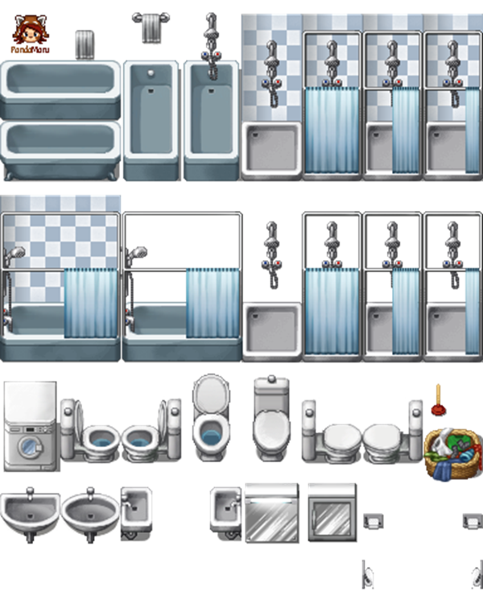
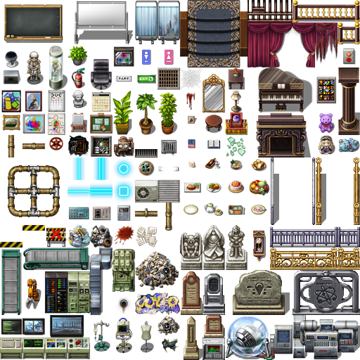
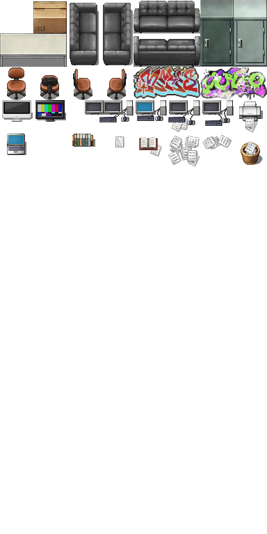

# Assets 
En esta sección vamos a explicar de dónde salen los recursos utilizados en los assets, así como referenciar su fuente y autor/es 
1. # Imágenes 

Estos tilesets (“*assets/TileMap”)* son de libre uso y de hecho la página está diseñada para poder usarla para otra aplicación de edición(RPG Maker)

Página Tilesets: <https://rpgmaker.top/recursos/tilesets/>

Hemos utilizado los siguientes tilesets para construir la imagen de fondo con la aplicación Tiled y para las capas de colisiones y muros hemos usado el tileset del muro.

|Autor: |Kadokawa / PandaMaru|
| :- | :- |
|Enlace Recursos del Autor:|
<https://forums.rpgmakerweb.com/index.php?threads/marus-mv-bits.46811/>

|
||
|Enlace Imagen:|<https://forums.rpgmakerweb.com/proxy.php?image=http%3A%2F%2Frpgmaker-mv.de%2FPandaMaru%2FRessourcen%2FMV%2FTilesets%2FPandaMaru_MV_nature3.png&hash=d2c1365b7760b8f8e159f028562cfaf3>|
||
|Enlace Imagen:|
<https://forums.rpgmakerweb.com/proxy.php?image=http%3A%2F%2Frpgmaker-mv.de%2FPandaMaru%2FRessourcen%2FMV%2FTilesets%2FPandaMaru_MV_bathroom_addon.png&hash=1146d267da6fb8bb4d0418fd8b4e3fce>

|
|Autor: |Avy / Avery|
|Enlace Recursos del Autor:|
<https://forums.rpgmakerweb.com/index.php?threads/avys-mv-stuff.53317/>

|
||
|Enlace Imagen: |<https://forums.rpgmakerweb.com/proxy.php?image=http%3A%2F%2Ffs1.directupload.net%2Fimages%2F180202%2F84idb2sh.png&hash=37d886e6973cf155914e40c73ba60690>|
||
|Enlace Imagen:|<https://forums.rpgmakerweb.com/proxy.php?image=http%3A%2F%2Ffs5.directupload.net%2Fimages%2F160503%2Ftspa65px.png&hash=90a50438217b543d6d62b05ff3c1f538>|
|Autor: |Haydeos|
|Enlace Recursos del Autor:|
<https://forums.rpgmakerweb.com/index.php?threads/materials-by-haydeos.47400/>

|
||
|Enlace Imagen:|<https://forums.rpgmakerweb.com/proxy.php?image=http%3A%2F%2Fi.imgur.com%2FqnSkWuO.png&hash=b610e946e35185538a53e4cc1a79f966>|
||
|Enlace Imagen:|<https://forums.rpgmakerweb.com/proxy.php?image=http%3A%2F%2Fi.imgur.com%2FT08kaQU.png&hash=1a61de429d0461b11b42583c706c1a55>|
|Autor: |My Piramids Stuff y Kadokawa|
|Enlace Recursos del Autor:|<https://forums.rpgmakerweb.com/index.php?threads/mr-pyramids-stuff.63456/>|
||
|Enlace Imagen : |<https://forums.rpgmakerweb.com/data/attachments/24/24645-74ac99f7540b43ed1666d1599e47103f.jpg>|
|Autor: |Ilikitea|
|Enlace Recursos del Autor:|
<https://forums.rpgmakerweb.com/index.php?threads/iliketeas-marvelous-tiles-updated-14-03-2017-closet-edits.60876/>

|
||
|Enlace Imagen:|
<https://forums.rpgmakerweb.com/proxy.php?image=http%3A%2F%2Fi.imgur.com%2Fdix2dHI.png&hash=38e16a8344b92e8254710100fe9f51f3>

|
||
|Enlace Imagen:|
<https://forums.rpgmakerweb.com/proxy.php?image=http%3A%2F%2Fi.imgur.com%2FsjcbB7s.png&hash=9906086ff9f5e13e3d582835dc5931ec>

|
|Autor: |Candacis Resources for MV|
|Enlace Recursos del Autor:|
<https://forums.rpgmakerweb.com/index.php?threads/candacis-resources-for-mv.60321/>

|
||
|Enlace Imagen|
<https://forums.rpgmakerweb.com/proxy.php?image=https%3A%2F%2Fwww.dropbox.com%2Fs%2Fhit7p692kmv684a%2FSF_Janitors_E.png%3Fraw%3D1&hash=1985fc119b8a1b65a1d3c1d99e484392>

|
|Autor: |SLEEP y MV "resources"|
|Enlace Recursos del Autor:|
<https://forums.rpgmakerweb.com/index.php?threads/sleepy-mv-resources.47234/>

|
||
|Enlace Imagen:|
<https://forums.rpgmakerweb.com/proxy.php?image=http%3A%2F%2Fi.imgur.com%2F4EbYgig.png&hash=6844cd331537f9d6ab152d7e0e78939f>

|
|Autor: |Kafu's "resources"|
|Enlace Recursos del Autor:|
<https://forums.rpgmakerweb.com/index.php?threads/kafu-s-resources.62453/>

|
||
|Enlace Imagen:|
<https://forums.rpgmakerweb.com/data/attachments/23/23152-824974e20209486107fb31e1ceba8c00.jpg>

|

Una vez explicado los assets del TileMap, proseguimos con el resto de recursos creados por nosotros mismos.

assets/cursorImg 

|[cursorCustom.cur](https://github.com/laurma40/proyecto_DVI/blob/pagina/assets/cursorImg/cursorCustom.cur)|Laura Martínez Tomás|
| :- | :- |
|[cursorHover.cur](https://github.com/laurma40/proyecto_DVI/blob/pagina/assets/cursorImg/cursorHover.cur)|Laura Martínez Tomás|

El resto de assets:

|[SpriteSheet_Batery3.png](https://github.com/laurma40/proyecto_DVI/blob/pagina/assets/SpriteSheet_Batery3.png) |Julia Fluiters Pereira|
| :- | :- |
|[armario-125-125.png](https://github.com/laurma40/proyecto_DVI/blob/pagina/assets/armario-125-125.png)|Francisco Javier Antoranz Esteban|
|[cama_530_330.png](https://github.com/laurma40/proyecto_DVI/blob/pagina/assets/cama_530_330.png)|Julia Fluiters Pereira|
|[casaInicio_v2.jpg](https://github.com/laurma40/proyecto_DVI/blob/pagina/assets/casaInicio_v2.jpeg)|Laura Martínez Tomás|
|[controlE.png](https://github.com/laurma40/proyecto_DVI/blob/pagina/assets/controlE.png)|Laura Martínez Tomás|
|[controlF.png](https://github.com/laurma40/proyecto_DVI/blob/pagina/assets/controlF.png)|Laura Martínez Tomás|
|[controles WASD.png](https://github.com/laurma40/proyecto_DVI/blob/pagina/assets/controlesWASD.png)|Laura Martínez Tomás|
|[filemon-250-400.png](https://github.com/laurma40/proyecto_DVI/blob/pagina/assets/filemon-250-400.png)|Julia Fluiters Pereira|
|[fondopixel2.jpeg](https://github.com/laurma40/proyecto_DVI/blob/pagina/assets/fondopixel2.jpeg)|Laura Martínez Tomás|
|[gameOver2.png](https://github.com/laurma40/proyecto_DVI/blob/pagina/assets/gameOver2.png)|Julia Fluiters Pereira|
|[luz.png](https://github.com/laurma40/proyecto_DVI/blob/pagina/assets/luz.png)|Julia Fluiters Pereira|
|[retry12.png](https://github.com/laurma40/proyecto_DVI/blob/pagina/assets/retry12.png)|Julia Fluiters Pereira|
|[retry22.png](https://github.com/laurma40/proyecto_DVI/blob/pagina/assets/retry22.png)|Julia Fluiters Pereira|
|[spritesheets_1row.png](https://github.com/laurma40/proyecto_DVI/blob/pagina/assets/spritesheets_1row.png)|Laura Martínez Tomás|
|[start3.png](https://github.com/laurma40/proyecto_DVI/blob/pagina/assets/start3.png)|Julia Fluiters Pereira|
|[start4.png](https://github.com/laurma40/proyecto_DVI/blob/pagina/assets/start4.png)|Julia Fluiters Pereira|
|[ventanaInicio.png](https://github.com/laurma40/proyecto_DVI/blob/pagina/assets/ventanaInicio.png)|Laura Martínez Tomás y Julia Fluiters Pereira|
|[ventanaJuego1.png](https://github.com/laurma40/proyecto_DVI/blob/pagina/assets/ventanaJuego1.png) y [ventanaJuego2.png](https://github.com/laurma40/proyecto_DVI/blob/pagina/assets/ventanaJuego2.png)|
Captura de los recursos utilizados anteriormente

|
|[llaves_de_colores.png](https://github.com/laurma40/proyecto_DVI/blob/pagina/assets/llaves_de_colores2.png)|Julia Fluiters Pereira y Víctor Giménez Chillada|
|[puertasSprite.png](https://github.com/laurma40/proyecto_DVI/blob/pagina/assets/puertasSprite.png)|Francisco Javier Antoranz Esteban|

También se han hecho ediciones de imágenes reales para pixel art:

|
Logo GitHub:

[githubicon.png](https://github.com/laurma40/proyecto_DVI/blob/pagina/assets/githubicon.png)
|
<https://github.githubassets.com/images/modules/logos_page/GitHub-Mark.png>

|
| :- | :- |
|
Logo Mortadelo:

[logo-studio.png](https://github.com/laurma40/proyecto_DVI/blob/pagina/assets/logo-studio.png)
|
<https://www.elmundo.es/promociones/comicsmortadelo/images/mortadelo_solo.png?crc=3758579294>

Creditos al autor de los cómics: [Francisco Ibáñez](https://www.google.com/search?rlz=1C1CHBF_esES912ES912&q=Francisco+Ib%C3%A1%C3%B1ez&stick=H4sIAAAAAAAAAONgVuLUz9U3MDcsNkt6xGjCLfDyxz1hKe1Ja05eY1Tl4grOyC93zSvJLKkUEudig7J4pbi5ELp4FrEKuRUl5iVnFifnK3gmHV54eGNqFQBOIefcWQAAAA&sa=X&ved=2ahUKEwiEx__g__z9AhXE_rsIHfEjAoUQzIcDKAB6BAgtEAE)
|

2. # Música y sonidos 

Todos los recursos de audio que se han recopilado hasta el momento proceden de la misma fuente, Zapsplat: <https://www.zapsplat.com/> .

|Pasos|<https://www.zapsplat.com/music/boys-sneaker-single-footstep-on-concrete-2/>|
| :- | :- |
|Botón linterna |<https://www.zapsplat.com/music/maglite-flashlight-button-press-to-switch-on-or-off-3/>|
|Abrir puerta |<https://www.zapsplat.com/music/old-slightly-rotten-wooden-door-close-gently-4/>|
|Coger objeto |<https://www.zapsplat.com/music/polymer-banknote-grab-snatch-out-of-a-persons-hand-2/>|
|Monstruo 1 |[https://www.zapsplat.com/music/monster-ogre-sleeping-weak-growl/](https://www.zapsplat.com/music/monster-ogre-sleeping-weak-growl/#)|
|Monstro 2 |<https://www.zapsplat.com/music/monster-ogre-single-weak-snarl/>|
|Grito Game Over |<https://www.zapsplat.com/music/18-month-old-toddler-scream-1/>|
|LLuvia |<https://www.zapsplat.com/music/distant-thunder-and-lightning-with-very-light-rain/>|
|Victoria |<https://www.zapsplat.com/music/game-sound-fast-glissando-win-award-2/>|
|Interferencias |<https://www.zapsplat.com/music/cb-radio-walkie-talkie-interference-crackle-1/>|
|Grito daño |<https://www.zapsplat.com/music/young-child-or-toddler-light-scream/>|
|Sonido noche |<https://www.zapsplat.com/wp-content/uploads/2015/sound-effects-audio-hero/audio_hero_NightAmbienceCalm%20PE011801.mp3/>|
|Grito Fin |<https://www.zapsplat.com/wp-content/uploads/2015/sound-effects-two/human-18-month-toddler-boy-scream-002.mp3/>|
|Sonido Fin |<https://www.zapsplat.com/wp-content/uploads/2015/sound-effects-55112/zapsplat_horror_strings_stabs_psycho_57646.mp3/>|
